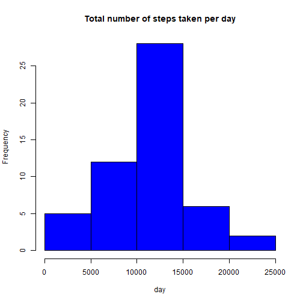
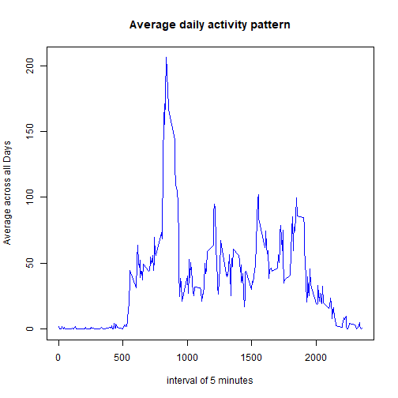
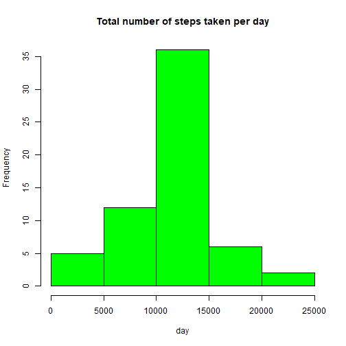

## Loading and preprocessing the data

First, set the working directory where the csv file is (Please modify if needed).
Loading the csv file and transform the date column in a date format.
Display a summary.


```r
wd <- "C:/PROJECTS/Data Science - Coursera/R working directory/Cours 5 - Reproducible Research/Semaine 2"
setwd(wd)
data <- read.csv("./activity.csv",sep=",",header=TRUE)
data$date <- as.Date(data$date,"%Y-%m-%d")
summary(data)
```

```
##      steps             date               interval     
##  Min.   :  0.00   Min.   :2012-10-01   Min.   :   0.0  
##  1st Qu.:  0.00   1st Qu.:2012-10-16   1st Qu.: 588.8  
##  Median :  0.00   Median :2012-10-31   Median :1177.5  
##  Mean   : 37.38   Mean   :2012-10-31   Mean   :1177.5  
##  3rd Qu.: 12.00   3rd Qu.:2012-11-15   3rd Qu.:1766.2  
##  Max.   :806.00   Max.   :2012-11-30   Max.   :2355.0  
##  NA's   :2304
```

## What is mean total number of steps taken per day?

First let show in an histogram the sum of steps by days (frequency)


```r
sumBydate <- tapply(data$steps,data$date,sum)
hist(sumBydate,main="Total number of steps taken per day",xlab="day",col="blue")
```



The mean and median are:


```r
mean(data$steps,na.rm=TRUE)
```

```
## [1] 37.3826
```

```r
median(data$steps,na.rm=TRUE)
```

```
## [1] 0
```

## What is the average daily activity pattern?

First, we plot the average of steps by interval of 5 minutes.


```r
meanByInterval <- tapply(data$steps,data$interval,mean,na.rm=TRUE)
plot(row.names(meanByInterval), meanByInterval, type = "l", xlab = "interval of 5 minutes", ylab = "Average across all Days", main = "Average daily activity pattern",col="blue")
```



Then we can answer the question: Which 5-minute interval, on average across all the days in the dataset, contains the maximum number of steps?


```r
max <- which.max(meanByInterval)
names(max)
```

```
## [1] "835"
```

## Imputing missing values

Calculate and report the number of missing values of steps in the dataset


```r
dataNA <- sum(is.na(data$steps))
dataNA
```

```
## [1] 2304
```

Devise a strategy for filling in all of the missing values in the dataset. The strategy does not need to be sophisticated. For example, you could use the mean/median for that day, or the mean for that 5-minute interval, etc.
--> I choose to fill NA values by the mean by 5-minute interval


```r
meanSteps <- aggregate(steps ~ interval, data = data, FUN = mean)
replaceNA <- numeric()
for (i in 1:nrow(data)) {
     line <- data[i, ]
     if (is.na(line$steps)) {
         steps <- subset(meanSteps , interval == line$interval)$steps
     } else {
         steps <- line$steps
     }
     replaceNA <- c(replaceNA, steps)
 }
```

Create a new dataset that is equal to the original dataset but with the missing data filled in.


```r
new_data <- data
new_data$steps <- replaceNA 
```

Make a histogram of the total number of steps taken each day


```r
sumBydate2 <- tapply(new_data$steps,new_data$date,sum)
hist(sumBydate2,main="Total number of steps taken per day",xlab="day",col="green")
```



Calculate and report the mean and median total number of steps taken per day. 


```r
mean(new_data$steps)
```

```
## [1] 37.3826
```

```r
median(new_data$steps)
```

```
## [1] 0
```

Do these values differ from the estimates from the first part of the assignment?
What is the impact of imputing missing data on the estimates of the total daily number of steps?  
No impact, mean and median are similar

## Are there differences in activity patterns between weekdays and weekends?

Create a new factor variable in the dataset with two levels - "weekday" and "weekend" indicating whether a given date is a weekday or weekend day.


```r
weekdays <- weekdays(new_data$date)
library(plyr)
weekendOrNot <- revalue(weekdays,c(Monday = "weekday", Tuesday = "weekday", Wednesday = "weekday", Thursday = "weekday", Friday = "weekday", Saturday = "weekend", Sunday = "weekend"))
new_data <- cbind(new_data,weekendOrNot)
```

Make a panel plot containing a time series plot of the 5-minute interval (x-axis) and the average number of steps taken, averaged across all weekday days or weekend days (y-axis). See the README file in the GitHub repository to see an example of what this plot should look like using simulated data.


```r
stepsByDay <- aggregate(steps ~ interval + weekendOrNot, data = data, mean)
library(lattice)
xyplot(steps ~ interval | weekendOrNot, stepsByDay, type = "l", layout = c(1, 2), xlab = "Interval", ylab = "Number of steps")
```


